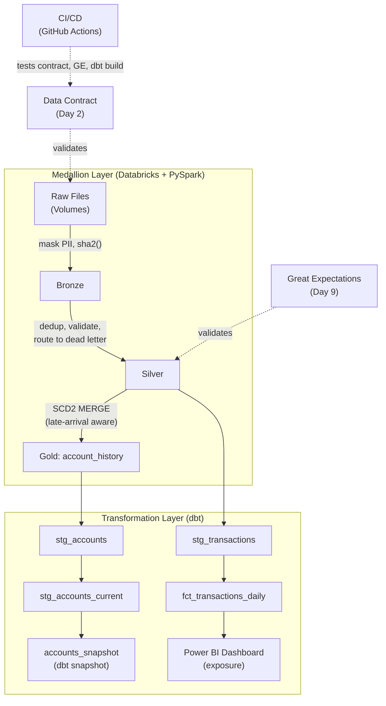
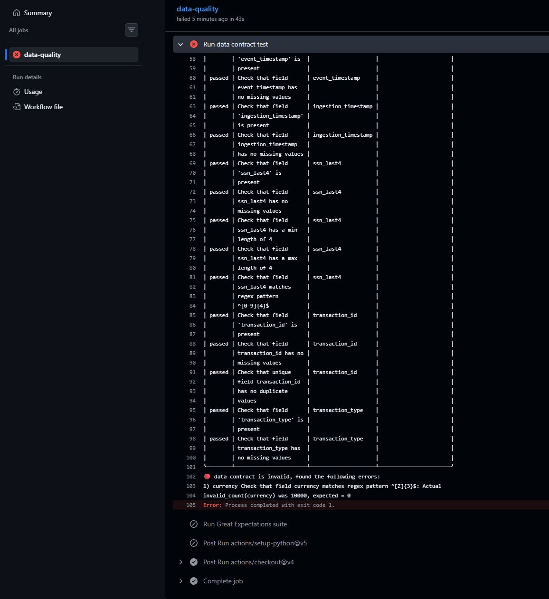
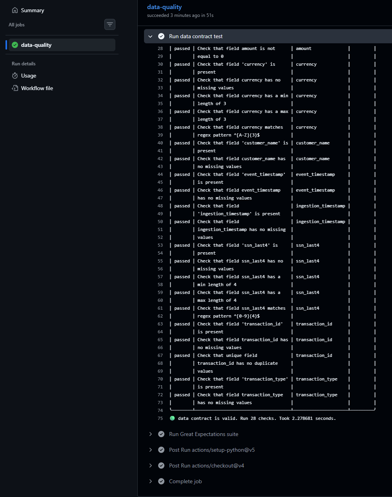
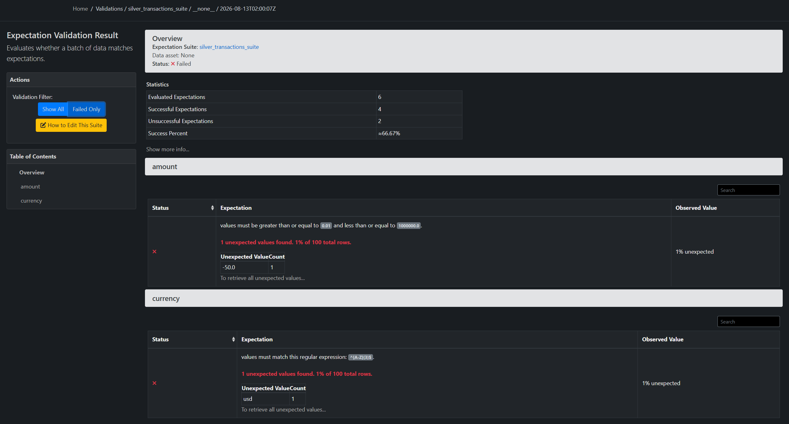
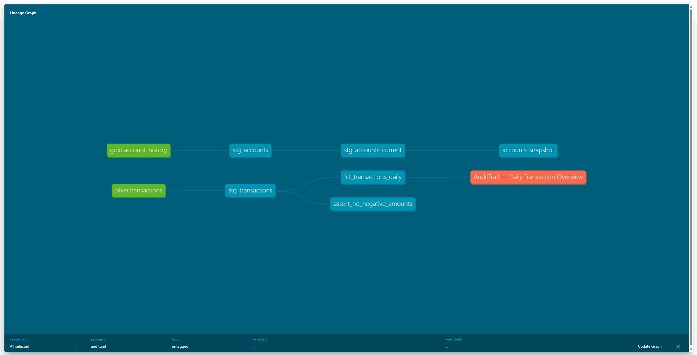
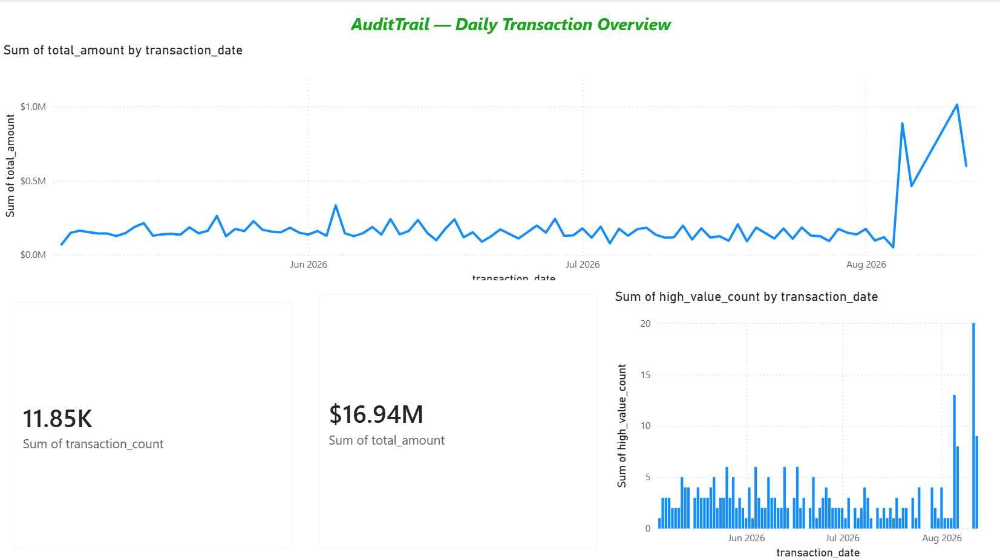

# AuditTrail

[](https://github.com/harshithbhushan/audittrail-lakehouse/actions/workflows/data_quality.yml)

AuditTrail is a production-style financial data lakehouse built on Databricks Free Edition, demonstrating schema contract enforcement, PII masking at ingestion, and SCD Type 2 account history for point-in-time auditability. All data is fully synthetic, generated with Faker to model realistic transaction volume and structure without using any real financial or personal information. See `LOG.md` for the full session-by-session build narrative and every design decision behind it.

## Problem Statement

Financial data pipelines have to answer questions an ordinary ETL job doesn't: what did this account look like on a specific date, not just what does it look like now? Did a batch of incoming transactions actually pass validation, or did something silently corrupt downstream reporting? Can a change discovered today, but effective weeks ago, be reflected correctly in history without breaking queries that already ran against it? AuditTrail is a from-scratch build answering exactly those questions — schema contracts and dead-letter routing so bad data never silently enters the warehouse, PII masked at ingestion so raw identity data never persists past Bronze, and two different, deliberately contrasted implementations of point-in-time account history, so the real tradeoffs between them are demonstrated, not just asserted.

## Architecture



## Stack

| Tool | Why |
|---|---|
| Databricks Free Edition | Unity Catalog governance, Delta Lake, and a SQL warehouse in one place, at zero cost for a portfolio-scale build. |
| PySpark | The transformation engine behind masking, validation, dedup, and the SCD2 `MERGE` logic — the practitioner-standard tool for schema-aware transformation at this scale. |
| Delta Lake | The storage format under every table, chosen specifically for `MERGE` support and native time travel (`VERSION AS OF`) — both load-bearing in this project, not incidental. |
| datacontract-cli | Enforces a schema/quality contract on the raw file *before* it's trusted enough to enter the lakehouse at all. |
| Great Expectations | Documentation-first validation — a browsable, accumulating history of what was checked, for an audience that never reads the pipeline code. |
| dbt (core + databricks) | The transformation/testing/documentation layer on governed data — lineage graph, generic tests, and a second, deliberately contrasting way to implement SCD2. |
| GitHub Actions | Automatically enforces the contract, GE suite, and `dbt build` on every push, so validation doesn't depend on a human remembering to run it. |
| Power BI Desktop | The business-facing consumption layer, connected live via the native Databricks connector, tracked in the project as a dbt exposure — a real lineage node, not a disconnected screenshot. |
| Faker | Generates fully synthetic transaction and account data — realistic volume and structure, zero real financial or personal information. |

## Continuous Integration

Every push to `main` regenerates a fresh, deterministic sample of transaction data and runs it through two independent checks: the Day 2 data contract and the Day 9 Great Expectations suite. Either failing fails the build. Verified both directions — a deliberately broken schema correctly turns the build red on the contract-test step specifically, and reverting it turns the build green across all three steps:




## Chaos Scenarios

**Chaos 1 — Poison Pill.** Before this could be tested properly, a more fundamental gap surfaced: the Bronze notebook had no way to distinguish an already-ingested file from a new one, so a naive rerun would have either silently dropped the previous batch (`overwrite` mode) or duplicated it (a wildcard read reprocessing files it had already seen). Fixed by parameterizing the read to a specific batch file per run and switching Bronze to `append` mode — it now grows correctly across batches instead of resetting or duplicating. With that fixed, the actual chaos test: a 1,000-row batch with 15% of amounts deliberately set to null or negative. Silver's dead-letter routing caught every one of them — 850 rows written to `silver.transactions`, 150 routed to `silver.transactions_dead_letter`, all correctly tagged `amount_invalid`, a 15.0% rejection rate that matches the injected poison rate exactly. Nothing was silently dropped; every rejected row is queryable, with a documented reason, in its own table. 

**Chaos 2 — Late Arrival.** Adapted from the original scenario: `transactions` is append-only with no ordering-sensitive logic, so the actual late-arrival risk lives in `account_history`'s SCD2 `MERGE`, not in the transaction feed. A record arrived reporting a credit review that had taken effect three days before the most recent change already on file. Run through the unmodified SCD2 `MERGE` from the previous session, this would have silently corrupted the table two ways at once: overwritten the current row's end date with a date earlier than its own start date — a chronologically impossible negative-duration window — and mislabeled the older, late-arriving fact as the account's current state while marking the real current state historical. The fix detects lateness by comparing the incoming date against the current row's start date specifically, locates which existing historical window the late fact actually falls inside, and splits that window in two within a single `MERGE` — shrinking the original row's end date and inserting a new row to fill the gap. Verified across 20 affected accounts: zero gaps, zero overlaps, the existing current state completely untouched.

**Chaos 3 — Duplicates.** A batch arrived with 5% of its transaction IDs appearing twice — the same transaction resent with a corrected amount and a later ingestion timestamp, a realistic retry/correction scenario rather than an identical, meaningless copy. Silver resolves duplicates before validation runs at all, using a `row_number()` window function partitioned by transaction ID and ordered by ingestion timestamp descending, keeping only the most recently ingested copy of each. Verified against the full cumulative table (12,050 rows across three batches ingested so far): dedup correctly removed exactly the 50 duplicated rows, keeping the corrected value in each case, with the rest of the batch passing validation cleanly.

## Data Quality Validation (Great Expectations)

On top of the ingestion-time contract (Day 2) and Silver's routing logic (Day 4), a Great Expectations suite validates `silver.transactions` against six expectations: not-null on `transaction_id`/`account_id`/`amount`, `amount` between 0.01 and 1,000,000, `currency` matching a 3-letter uppercase pattern, and `transaction_id` uniqueness. Configured to raise on failure — a validation break can fail a CI step, not just get silently logged. Below, a deliberately corrupted batch correctly failing exactly two expectations (amount range, currency format), captured from the suite's own generated Data Docs report:



## Data Lineage

Generated via `dbt docs generate` — the full dependency graph from raw governed tables through to the business-facing dashboard: `silver.transactions`/`gold.account_history` → staging models → `fct_transactions_daily`/`accounts_snapshot` → the Power BI exposure. Every arrow in this graph is a real `ref()`/`source()` call in the project, not a diagram drawn by hand.



## Business-Facing Dashboard

A Power BI dashboard connects live to the Databricks SQL warehouse (native connector, Import mode) against `fct_transactions_daily`, tracked in this repo as a dbt `exposure` so it shows up in the lineage graph above as a real downstream consumer, not just a screenshot with no connection to the pipeline that feeds it.



## SCD Type 2: Two Approaches

Account history is implemented two different ways in this project, deliberately, to make a real tradeoff visible rather than silently pick one. `gold.account_history` (Days 6–8) uses a custom Delta `MERGE`: it locates exactly which historical window a change belongs to by its *business-effective date*, splitting that window if needed — a correction discovered today but effective weeks ago still lands in the correct place in history. `snapshots.accounts_snapshot` (Day 12), tracking the same two attributes (`account_status`, `credit_limit`) via dbt's `check` strategy, works fundamentally differently: on every run it diffs current state against what it last recorded and stamps any change with `dbt_valid_from` set to *that run's own timestamp* — it has no concept of when a change was actually effective, only when the snapshot happened to notice it. I'd reach for a dbt snapshot when the transformation layer is allowed to own the definition of history — it's simpler to build and maintain, and correct as long as "when we noticed it" is an acceptable stand-in for "when it happened." I'd reach for the custom `MERGE` approach specifically when late-arrival correctness matters to the business — account history for a financial audit trail being exactly that case, where "what was true on this date" needs a real answer, not an artifact of when a batch job happened to run.

## How to Run

**Prerequisites:** a Databricks Free Edition account, Python 3.12+, and (optional) Power BI Desktop for the dashboard.

1. **Clone and install:**
   ```powershell
   git clone https://github.com/harshithbhushan/audittrail-lakehouse.git
   cd audittrail-lakehouse
   pip install -r requirements.txt
   ```

2. **Databricks setup.** Create the landing volume and medallion schemas (exact SQL in `notebooks/session03_bronze_masking.py`, Cell 1), then generate and upload the raw data:
   ```powershell
   python scripts/generate_transactions.py
   python scripts/generate_account_snapshots.py
   ```
   Upload the resulting CSVs to `workspace.landing.raw_files` via the Databricks UI.

3. **Run the notebooks, in order**, from `notebooks/`: Bronze masking → Silver dead-letter routing (with dedup) → SCD2 account history (unified normal + late-arrival `MERGE`) → Great Expectations suite. Each notebook's cells are self-contained and commented with the reasoning behind each choice, not just what the code does.

4. **Data contract:** `datacontract test datacontract.yaml --server local_csv` — validates the raw file's structure independently of the pipeline itself.

5. **dbt.** Create `~/.dbt/profiles.yml` with your own real credentials (field names shown in `dbt/audittrail/ci/profiles.yml` — that file itself only holds environment-variable references, never real values; never commit a version of this file with actual credentials in it), then:
   ```powershell
   cd dbt/audittrail
   dbt build
   ```

6. **(Optional) Power BI dashboard:** connect Power BI Desktop to your SQL warehouse via the native Databricks connector, Import mode, against `workspace.marts.fct_transactions_daily`.

7. **CI/CD** runs automatically on every push to `main` once three GitHub repo secrets are set (`DATABRICKS_HOST`, `DATABRICKS_HTTP_PATH`, `DATABRICKS_TOKEN`) — see `.github/workflows/data_quality.yml`.

Three additional audit/time-travel queries, each grounded in this project's own real history, are in `queries/`.

## Walkthrough

*2-minute video walkthrough: [link pending]*